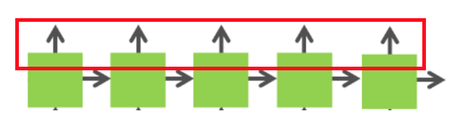

[Proposal](/proposal.md)&nbsp;&nbsp;&nbsp;&nbsp;|&nbsp;&nbsp;&nbsp;&nbsp;
[Checkpoint](/checkpoint.md)&nbsp;&nbsp;&nbsp;&nbsp;|&nbsp;&nbsp;&nbsp;&nbsp;
[Final Report](/index.md)

**Yifan Jiang(yjiang1)**		**Xiangguang Zheng(xiangguz)**

Summary
-------
The goal of this project is to implement a LSTM DSL(Domain Specific Language), which provides RNN researchers a set of handy primitives to experiment with different LSTM-like RNN structures, which are then scheduled and run on GPUs in an efficient way. To achieve the goal of scheduling LSTM network dynamically, we started from optimizing the feedforward process of  the classic LSTM network in a static way using Cuda blocks and CuBlas. Referring to the technical blog [link] by NVIDIA's team, we implemented a series of optimizations and achieved a ~776x speedup compared to the native python implementation (not our main focus) and a ~10x speedup compared to the naive LSTM implementation in Cuda (both run on GHC machines).  Then we designed a generalized and schedulable LSTM engine, targeting to get closed to the performance achieved through static optimization as much as possible. Due to time constraint, we shifted our focus to building an IR (intermediate representation) in C++ and cuda, which acts as the backend engine of the DSL frontend in our original plan. This LSTM scheduler implementation applied several optimizationsis expected to achieve a speedup around ~4x compared to the naive CUDA implementation and ~0.8x compared to the static LSTM optimization.

Background
----------
Long short-term memory(LSTM) is a recurrent neural network architecture that is capable of learning long-term dependencies. It has been proven to be very powerful in classifying, processing and predicting inputs with time series (composing articles, translating etc.). The image below shows a classic LSTM cell and the operations involved in it:

<b>Figure 1</b>

Challenges
----------
1. LSTM network exposed a lot of dependencies between the node, where we need to carefully design our optimization to extract the independent component to do parallel computation in specific stage, while conforming the dependencies relationship.
2. We are not trying to make static optimizations for each variant of LSTM and instead using a dynamic manner to schedule the computations. Therefore our framework has much better salability when applying to a more generalized structure.
3. Because of the dynamic nature of our LSTM scheduler, static optimization is really hard to apply to the dynamic scheduler.

Static LSTM Optimization
------------
Our optimizations are inspired by [this blog](https://devblogs.nvidia.com/parallelforall/optimizing-recurrent-neural-networks-cudnn-5/).
### Combining weight matrices
The traditional LSTM formula requires to do matrix multiplication for input data with four weight matrix. Instead of do 4 matrix multiplications, we combined 4 weight matrix together to  do a combined matrix multiplication. Overall, we reduce 8 matrix multiplication to 2 for both R*h and W*x.

Figure 2&3 show the details of combined matrix multiplication:

<b>Figure 2</b>

<b>Figure 3</b>

In order to do combined matrix multiplication correctly, we need to stack 4 matrix vertically. However, cublas is column-dominated matrix, vertically stacking matrix requires that all elements in 4 matrix stored in interleaved position in memory. Therefore, assuming the weight is generated in contiguous memory space, we need to do a pre-transpose in order to get a vertically stacking combined matrix for combined matrix multiplication.

<b>Figure 4</b>

### Fusing element-wise operations

Besides the 8 matrix multiplications, the rest of the computations are all elementwise operations. Therefore, we can avoid the overhead of launching multiple kernels by combining these computations into one kernel.

### Combining input matrices  
For matrix multiplication between W and x, dependency relationship is in vertical direction, because the input x at time t only depends on the previous layer at time t. Therefore, we are able to combine the input matrix x in contiguous horizontal node to achieve better performance.

<b>Figure 5</b>

### Parallelizing multiple layers
There are two dependency relationships in LSTM, input x at time tis depend on previous layer at time t (the node below), input h is depend on same layer at time t - 1(the node to the left). Therefore, an approach to achieve parallelism between multiple layers is to run nodes in diagonal at the same time, as the graph shown below.

<b>Figure 6</b>

Results (Part 1)
----------------
Our experiment is running on GHC machines(NVDIA GTX1080).

<b>Figure 7</b>

Compare the speedup of different static optimizations, using network 1.

<b>Figure 8</b>

Challenges of LSTM scheduler
----------------------------
1. There exist dependencies between gates for some LSTM variants(shown in Figure 9). Some matrix multiplications can not be combined since they depend on each other. The scheduler needs to explore independent matrix multiplications and allocate the weights in contiguous memory so that they can be combined.
2. LSTM variants have different element-wise operations that can not be scheduled statically. The scheduler needs to explore potential element-wise blocks and generate a fused Cuda kernel for each of them.
3. LSTM variants could have recurrent loops on different data. Traditional LSTM has both recurrent state and output, while GRU has only recurrent output. The scheduler should allow users to determine which part of the being recurrent.

<b>Figure 9</b>

LSTM Invariants
---------------
1. Hyperparameters that all LSTM variants care about. Some example are number of layers, number of time steps for each layer, number of hidden units etc.
2. All LSTM variants (well-known) can be expressed with the same set of primitives, as shown in Figure 10.

<b>Figure 10</b>

Approach
--------
Our approach is inspired by Tensorflow's architecture - using a DAG to represent a computation flow. Each node in the graph either represents a data point(weights/vectors) or operator.
- Some primitives are provided for users to define an arbitrary LSTM model. Here shown a piece of code that define a forget gate in classic LSTM.

<b>Figure 11</b>

- The user-defined model is then pre-processed by the intermediate layer so that:
1. All element-wise operation blocks are explored and fused into a special fused node.
2. All the potential matrix multiplication comibination are explored.
3. Temporary data requriement is analyzed. In LSTM scheduler, temporary data is used to store the output of matrix multiplication and fused element-wise nodes.

<b>Figure 12</b>

- Cuda/Cublas file is then generated based on the pre-processed LSTM model. To generate the file, the computation graph is traversed using BFS with taking into considration the computation dependencies between nodes.

<b>Figure 13</b>

------------------------------
Results(Part 2) and Conclusion

Because we spent too much time in research as well as incorrectly predicted the complexity of this project, we don't have a working version yet for the dynamic scheduler. We were able to implemented the pre-processing part but not the generation of CUDA code. However, based on the optimization we applied to our design of dynamic scheduler, we predict the expect result in Figure 14.

<b>Figure 14</b>

List of Work by Each Student
----------------------------
Equal work was performed by both project members.

References
----------
\[1]: CS231n Lecture 10 - Recurrent Neural Networks: https://www.youtube.com/watch?v=iX5V1WpxxkY\  
\[2]: Christopher Olah. Understanding LSTM Networks: http://colah.github.io/posts/2015-08-Understanding-LSTMs/  
\[3]: Andrej Karpathy. The Unreasonable Effectiveness of Recurrent Neural Networks: http://karpathy.github.io/2015/05/21/rnn-effectiveness/  
\[4]: Lipton, Z. C., Berkowitz, J., & Elkan, C. (2015). A Critical Review of Recurrent Neural Networks for Sequence Learning.  
\[5]: Nvidia. cuBLAS toolkit documentation: http://docs.nvidia.com/cuda/cublas/#axzz4fJQIdbFQ  
\[6]: Nvidia. cuDNN User Manual: https://developer.nvidia.com/cudnn  
\[7]: Nvidia. Optimizing Recurrent Neural Networks in cuDNN 5: https://devblogs.nvidia.com/parallelforall/optimizing-recurrent-neural-networks-cudnn-5/  
\[8]: Engel, Jesse. "Optimizing RNNs with Differentiable Graphs." Baidu Silicon Valley AI Lab  

